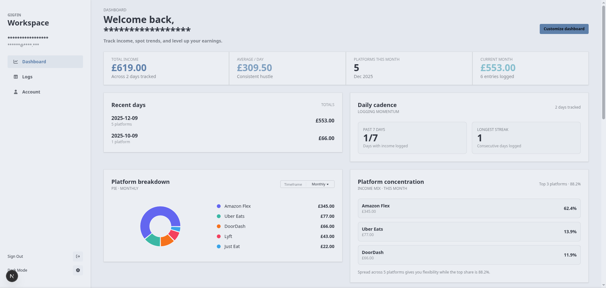
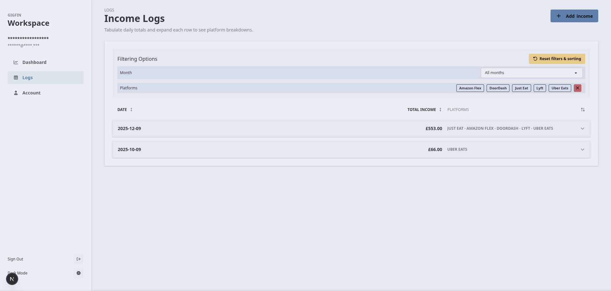
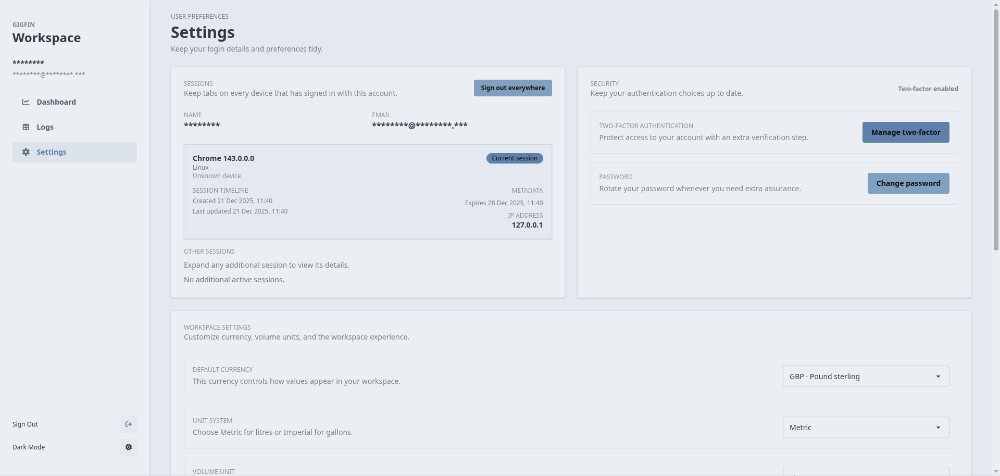

<p align="center">
  
</p>

# GigFin

[](LICENSE)
[](https://github.com/sayedhfatimi/gigfin/commits)
[](https://github.com/sayedhfatimi/gigfin)
[](https://github.com/sayedhfatimi/gigfin/issues)

GigFin helps gig workers keep a simple, reliable ledger of their overall income across platforms alongside monthly trends and platform breakdowns. Because the app focuses on platform-level income totals, it currently does not track individual line items per platform. Recent updates add customizable dashboards, built-in expense tracking, and vehicle profiles while keeping the same responsive Next.js dashboard, Better Auth–powered credential login, 2FA, and fast SQLite + Drizzle ORM backend so you can log earnings securely from any device.

A hosted instance is available at https://gigfin.me, but GigFin is designed for self-hosting, and deploying your own instance is the recommended way to keep your data private and under your control.

## Table of Contents

- [GigFin](#gigfin)
  - [Table of Contents](#table-of-contents)
  - [Screenshots](#screenshots)
  - [What’s inside](#whats-inside)
  - [Tech stack](#tech-stack)
  - [Prerequisites](#prerequisites)
  - [Environment variables](#environment-variables)
  - [Deployment guidance](#deployment-guidance)
    - [Docker \& Compose](#docker--compose)
    - [Coolify](#coolify)
  - [Getting started (local development)](#getting-started-local-development)
  - [Build \& test](#build--test)
  - [Contributing](#contributing)
  - [License](#license)

## Screenshots

<p align="center">
  
</p>

<p align="center">
  
</p>

<p align="center">
  
</p>

## What’s inside

- **Customizable, feature-rich dashboard:** Totals, average‑per‑day, and platform mix charts plus recent daily summaries pair with configurable cards, metric prioritization, and saved layouts.
- **Detailed expense tracking:** Capture receipts, tag costs to gigs, and keep deductible-ready summaries beside your income totals.
- **Vehicle profiles & maintenance:** Track each bike or car with fuel, mileage, and service notes so every trip stays tied to the right ride.
- **Log & filter entry history:** Add income per platform and filter by months or platforms to compare runs.
- **Local persistence:** Drizzle + SQLite stores every entry in `/app/data/db.sqlite`, so the Docker stack keeps state in a named volume.
- **Security-first auth:** Credential login, signup, and optional 2FA flows powered by Better Auth keep sessions locked down.
- **Theming & accessibility:** Adaptive light/dark styles bring clarity to the hero copy, quick add forms, and stats view.

## Tech stack

- **Next.js 16** (App Router) & **React 19**
- **Drizzle ORM / Drizzle-Kit** for migrations and SQLite helpers
- **better-auth** for token management, signup/login, and Two-Factor Auth
- **TanStack Query & Table**, **Recharts**, and **DaisyUI/Tailwind** for the UI surfaces

## Prerequisites

- Node.js (LTS recommended) for local development
- Docker + Docker Compose for production/self-hosting

## Environment variables

GigFin expects the following values at runtime (set them via Coolify, another secrets manager, or a local `.env` file loaded with `dotenv`):

- `BETTER_AUTH_SECRET` (required): a secure string that Better Auth uses for signing. Generate one with `npx @better-auth/cli@latest secret` or `openssl rand -base64 32`, then keep it out of version control.
- `BETTER_AUTH_URL` (required): the public URL where your GigFin instance is reached (for example `https://gigfin.me` or your custom domain). It must match the redirect URL configured in Better Auth.
- `DB_FILE_NAME` (optional): connection string for SQLite (default: `file:./data/db.sqlite`). If you override it, make sure the path matches the named Docker volume or host directory you that want to persist.
- `INTERNAL_API_BASE` (optional): internal API endpoint that GigFin pings (default: `http://localhost:3000`). Change it only if you run the frontend and backend on different hosts.

Bake these values into `.env` before running `npm` scripts or supply them through your orchestration platform so they are available to both the build and runtime environments.

## Deployment guidance

### Docker & Compose

1. Build and run the containerized stack:

   ```bash
   docker compose up --build
   ```

2. The multi-stage `Dockerfile` seeds `/app/data/db.sqlite` by running `npx drizzle-kit migrate` when the file is absent and copies `/app/data` into the runner stage.
3. `docker-compose.yml` binds the `gigfin-data` volume to `/app/data`, so the SQLite database survives restarts.
4. Docker Compose sources runtime environment variables from `.env` (see the `env_file` section in `docker-compose.yml`); store secrets there or inject them from your deployment platform.

Bring it down with `docker compose down` when you need to rebuild.

### Coolify

- Fork the repo and add it as a new service in Coolify, picking the **private repository** option if you want automatic builds on updates.
- In Coolify select the **docker-compose** deployment option, provide the required environment variables, and deploy—no extra build configuration is needed once the stack starts.

## Getting started (local development)

This section explains how to set up a local development environment for hacking on GigFin or contributing changes. If you only need to run a production instance, skip ahead to **Docker & Compose** or **Deployment guidance**.

1. Install dependencies:

   ```bash
   npm install
   ```

2. Copy `.env.example` (if it exists) to `.env` or create your own file with the recommended values and add any additional secrets you need.

   ```env
   DB_FILE_NAME=file:./data/db.sqlite
   BETTER_AUTH_SECRET=your-secret
   BETTER_AUTH_URL=http://localhost:3000
   ```

3. Generate or refresh the SQLite schema whenever you change database definitions:

   ```bash
   npx drizzle-kit migrate
   ```

4. Start the dev server:

   ```bash
   npm run dev
   ```

   Next.js watches your changes and reloads automatically. Open http://localhost:3000 in a browser to log in or sign up as a gig worker.

Once you have a working dev environment, run `npm run lint` and `npm run build` to verify there are no formatting or compilation issues before opening a PR.

## Build & test

- Run `npm run build` to compile the app for production; the Docker build stage already runs this.
- Run `npm run lint` to validate formatting and coding standards via Biome.

## Contributing

PRs welcome. Before opening one:

- Fork the repo, create a feature branch, and keep commits focused (squash or rebase before merging).
- Follow **Getting started (local development)**, then refresh migrations and run `npm run lint` plus `npm run build` to confirm the changes pass checks.
- Link relevant issues in the PR description, explain your approach, and note any follow-up work or deployment steps.

When the branch is ready, open a PR targeting `main`, include screenshots or recordings if you touched the UI, and wait for CI to pass before merging.

## License

This project is MIT licensed. See [LICENSE](LICENSE) for the full text.
